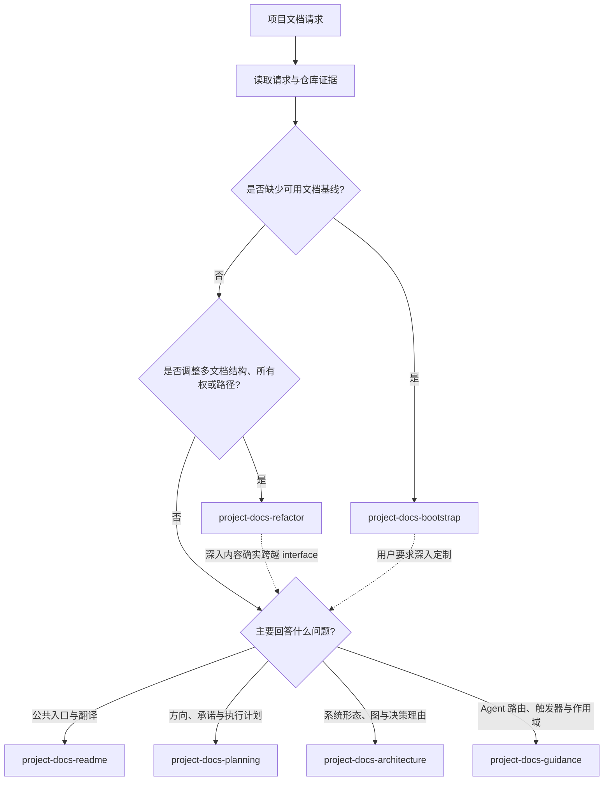

# Project Docs 多 Skill 目标设计

状态：2.0 目标设计与本地实现已验证；第二真实仓库与 Claude Code 运行验证仍是未完成门禁。

## 背景

`project-docs-bootstrap` 1.x 同时承担文档初始化、现有文档重构、README、里程碑 TODO、架构入口、目录 README 和项目指导文件维护。单一入口降低了早期使用门槛，但 description 难以准确区分请求，主文件持续膨胀，各能力也无法独立验证和演进。

2.0 按用户要解决的问题建立六个独立 Skill。生命周期 Skill 处理跨文档基线或结构，文档专项 Skill 处理单一能力域；一次请求默认只有一个主 Skill，真正跨越 interface 时才组合。

相关决策见 [`0001-split-project-docs-by-user-intent.md`](../adr/0001-split-project-docs-by-user-intent.md)。

## 目标与非目标

目标：

- 提高自动触发准确度，再减少上下文并支持独立演进。
- 保留 `project-docs-bootstrap` ID，但把它收窄为文档基线初始化。
- 为 README、项目规划、架构和 agent 指导文件建立独立、可验证的 interface。
- 让新项目有实用默认值，让现有仓库优先保留一致且有证据的约定。
- 保持每个 Skill 自包含，不建立运行时共享 reference 或硬依赖。

非目标：

- 不同步 GitHub Issues、Jira 等外部任务系统。
- 不维护 `CONTRIBUTING.md`、人工维护手册等面向人类的协作文档。
- 不把文档维护授权扩展为源码修改、外部发布或用户全局配置修改。
- 不为所有项目规定固定 README 标题、篇幅、完成时长或通用模板；由目标受众和条件化公共入口契约决定内容。

## Module interfaces

| Skill ID | Interface | 主要排除项 |
| --- | --- | --- |
| `project-docs-bootstrap` | 为没有非占位公共入口的仓库创建最小、真实、可导航的基线 | 已有公共文档的结构混乱；单一文档的深入维护 |
| `project-docs-refactor` | 审查或实施文档所有权、位置、迁移、链接、索引和目录 README 重构 | 根 README 内容维护；规划或架构语义深化 |
| `project-docs-readme` | 维护根 README、受维护翻译、公共能力与最短已验证路径 | 目录 README、技术索引和贡献指南 |
| `project-docs-planning` | 设计或实质维护 roadmap、milestone、backlog、task 和 plan 组成的仓库内规划体系 | 例行勾选或证据同步；外部 tracker 状态 |
| `project-docs-architecture` | 维护 current/target architecture、Mermaid 图、ADR 和代码—文档一致性 | 普通内部重构；未授权的源码修改；实施步骤 |
| `project-docs-guidance` | 维护 `AGENTS.md`、`CLAUDE.md` 等 agent 指导文件、目录作用域和平台差异 | 面向人类的协作手册和用户全局配置 |

每个 module 的 frontmatter description 是自动发现 interface；`SKILL.md` 保存核心流程和停止条件；references 只承载特定分支需要的模板、边例和专题规则。

## 路由

确定性规则：

1. 用户明确指定的有效工作优先，但错误 Skill 名不得扩大该 Skill 的 interface。
2. 单一文档意图优先专项 Skill；文件数量本身不决定路由。
3. 没有能表达项目目的与最短路径的非占位公共入口时使用 bootstrap；已有非占位公共文档但部分内容缺失、重复或所有权混乱时使用 refactor。
4. 模糊的“整理项目文档”先只读盘点，再选一个主 Skill；只有高影响长期结构选择才询问。
5. 普通任务按既有规划契约补一条状态或证据时，不加载 planning Skill。
6. 同一请求同时要求目标系统结构与实施步骤时，architecture 为主并先确定边界，planning 为辅维护阶段、验证和回滚；目标结构已由权威文档确定且只问实施方法时，仅使用 planning。

## 共同不变量

六个 Skill 只重复以下短底线，详细流程由自然所有者维护：

1. 编辑前读取仓库证据和适用项目指导。
2. 尊重既有权威位置、清晰约定和用户拥有的改动。
3. 不编造项目目的、架构、命令结果或完成状态。
4. 同一主题保留一个权威来源，其他位置使用短路由或链接。
5. 按“仓库证据 → 插件默认值 → 高风险澄清”作出决策；“按默认值”不授权越过任务范围或不可逆风险。
6. 回读改动，检查链接和 diff，并报告假设、验证及未执行门禁。

## 默认文档模型

### 初始化

- 根 README 是唯一必需入口。
- 只有存在真实活动工作、候选工作或路线决策时才创建规划入口；新项目默认根 `TODO.md`。
- 只有多份技术文档需要导航时才创建索引；新项目默认 `docs/index.md`，现有有效 `docs/README.md` 不因偏好被重命名。
- 只有存在真实架构内容时才创建 architecture 文档；只有对应工具或真实规则存在时才创建项目指导文件。
- 不创建空模板或推测性文档。

### README

- 先沿用仓库语言；新项目默认英文根 README。
- 只有明确受众、用户要求或既有双语约定时才创建翻译。
- 翻译保持章节结构、公共事实、能力和链接一致，允许自然本地化表达。
- 存在终端用户时，先服务最缺乏经验的预期用户并完成首次成功路径，再介绍 internals、architecture 和维护细节。
- 最小内容包括项目目的、目标读者、用户能力、合理前置条件、推荐的首次成功路径、可观察结果，以及规划入口和必要技术文档链接。
- 多路径先推荐一个默认入口再分支；新手路径解释必要概念和命令输入位置，文件或模板项目在有帮助时说明先改什么和不要直接改什么。
- 关键工具的前置安装优先链接官网，并在合理范围内提供各受支持平台或客户端的一个可验证推荐步骤、启动或验证命令和成功信号；无法验证时披露边界。
- 稳定且常见的首成功阻塞项保留短故障排查，其余链接到权威文档。
- 定位、结构、安装或快速开始的实质改动默认先给出只读审计和有序计划，等待确认后编辑；用户已明确确认同一计划或要求直接实施时不重复阻塞。

### Planning

`TODO.md` 是一种载体；规划概念分别为：

- Roadmap：方向、结果、阶段与依赖，不是远期 task checklist。
- Milestone：已承诺推进、有结果和退出条件的交付边界。
- Backlog：尚未进入当前承诺的候选工作。
- Task：可执行、可验证的工作单元。
- Plan：复杂任务或 milestone 的实施方法、顺序、验证和回滚。

每个项目声明一个活动工作入口。轻量项目使用 `TODO.md`；需要时渐进增加 `ROADMAP.md`、`docs/milestones/` 和 `docs/plans/`。允许一个 primary milestone 和明确标记的 secondary active milestones；默认选择 primary 的有效 Current focus、显式高优先级 ready task，再按文档顺序选择 ready task。不得自动切换 secondary 或提升 backlog。

Milestone 以结果和退出条件完成。Tasks 可以新增、替换、取消或移回 backlog，但必须说明理由，且不能靠删除或弱化退出条件制造完成状态。简单 task 可以只勾选；非简单 task 记录关键验证；milestone 完成时记录结果、退出条件证据和未解决事项。

### Architecture

- 沿用现有清晰布局；无约定时用 `docs/architecture.md` 描述当前态，首次合格 ADR 才创建 `docs/adr/`。
- Current architecture、target architecture 和 ADR 分别回答“现在是什么”“目标是什么”“为什么这样选择”。Plan 回答“如何实施”。
- 当前态架构概览和独立子系统架构文档必须包含图；ADR 和实施 Plan 只在图确实表达关键关系时添加。
- Mermaid 是默认可 diff 表达格式。借鉴 C4 分层，按实际复杂度选择 System Context、Container 或 Component，不要求完整四层。
- 代码与文档不一致时，先判断文档过期、实现偏离或目标尚未落地；architecture Skill 不因文档任务擅自修改源码。
- ADR 使用连续编号和短正文；accepted ADR 保留历史语义，变化通过新 ADR supersede。

### Project guidance

- 只在用户要求、对应工具正在使用，或确有路由、工作流触发器或高风险边界时创建。
- 根文件只保留全局规则；局部规则下沉到最深适用目录；创建前验证对应平台的发现、继承和优先级语义。
- 多平台指导文件是薄入口：共同事实链接 README、活动规划入口和具名技术文档，只重复必须立即可见的短路由与高风险边界。
- 规划集成只保留“工作前读取活动入口、交付前按其契约同步状态”的短路由。

## Reference 所有权

| Reference 主题 | 唯一所有者 |
| --- | --- |
| 文档盘点、迁移和 redirect note | `project-docs-refactor` |
| 目录 README | `project-docs-refactor` |
| README 公共入口和翻译 | `project-docs-readme` |
| 规划模型和默认布局 | `project-docs-planning` |
| Mermaid/C4、ADR 和架构漂移 | `project-docs-architecture` |
| Agent 指导文件审查 | `project-docs-guidance` |

Bootstrap 不跨目录引用其他 Skill；它只包含交付最小基线所需的浅规则。组合发生在任务路由层，不发生在文件依赖层。

## 分发与验证契约

- `project-docs-bootstrap` 保留 ID 但移除重构职责；插件按 breaking change 升为 `2.0.0`，不提供过渡 router。
- Catalog 和安装检查校验六个目标 Skill。升级 E2E 对旧版校验旧版实际 Skill 集，对目标版校验 catalog 完整 Skill 集。
- Marketplace 为六个 Skill 提供独立默认提示；中英文 README 为每个 Skill 提供可链接入口。
- 每个 `SKILL.md` 至少包含一个正例和一个近邻反例；bootstrap/refactor 另有组合示例。
- 本地 Codex 对六个 Skill 做显式发现测试，并运行相邻边界场景。Claude manifest 保留静态验证，但在没有 Claude Code 的主机上不宣称 CLI、升级或模型路由已验证。
- 本仓库回归之外，至少在一个规模或成熟度不同的真实仓库逐 Skill 记录场景；缺少该证据时，相关 TODO 保持未完成。
